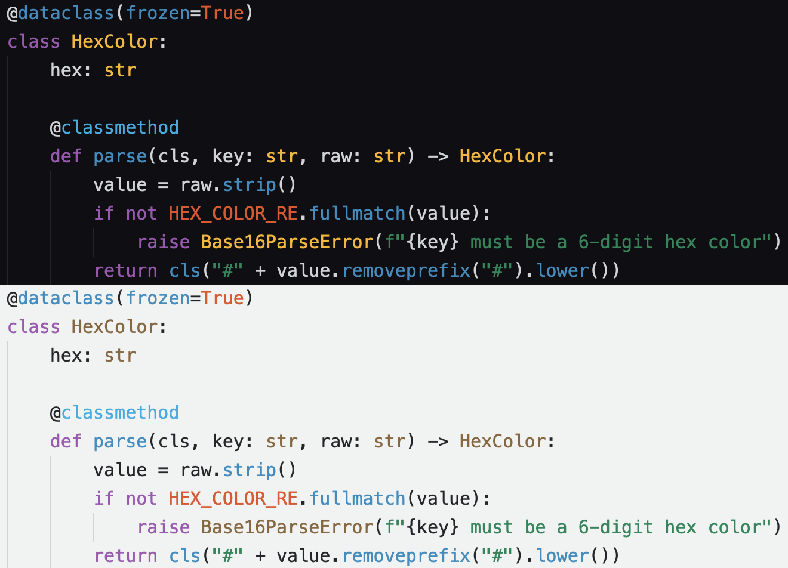

# meowtheme

<p align="center">
  
</p>

Light and dark `meow` theme for Zed, Vim, Xcode, macOS Terminal, Codex, Codex Desktop, and
opencode.

## Artifacts

Ready-to-use theme artifacts are stored in `output/`.

## Development

To generate theme artifacts from `meowtheme.yaml`, run:

```sh
just generate
```

To run tests, run:

```sh
just test
```
